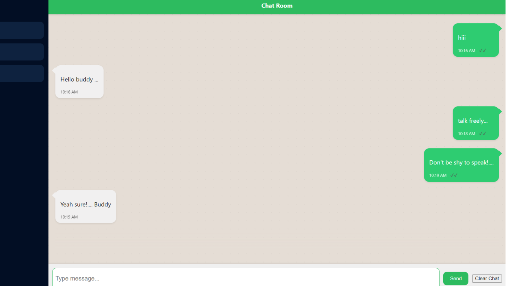
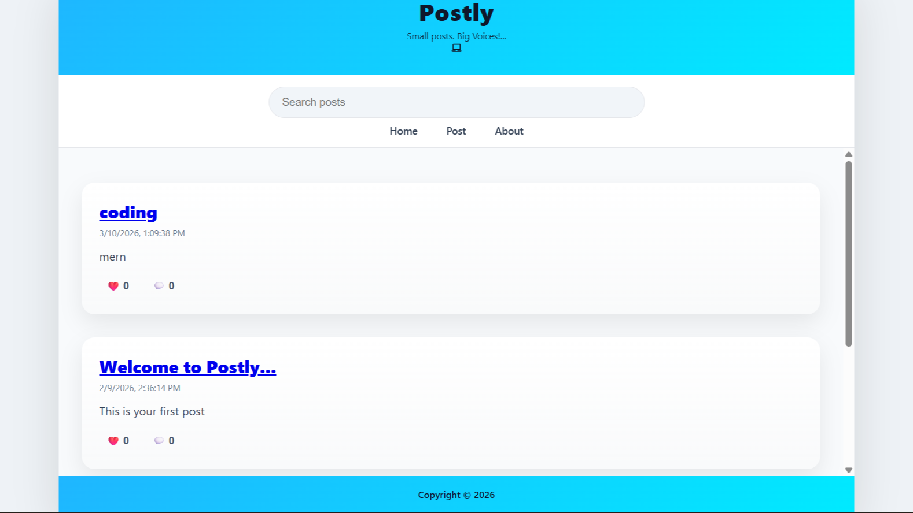
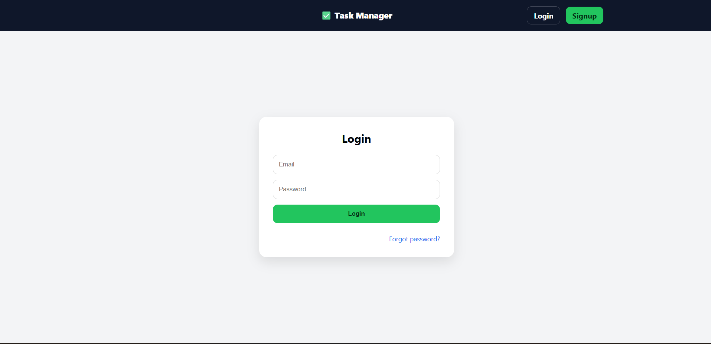
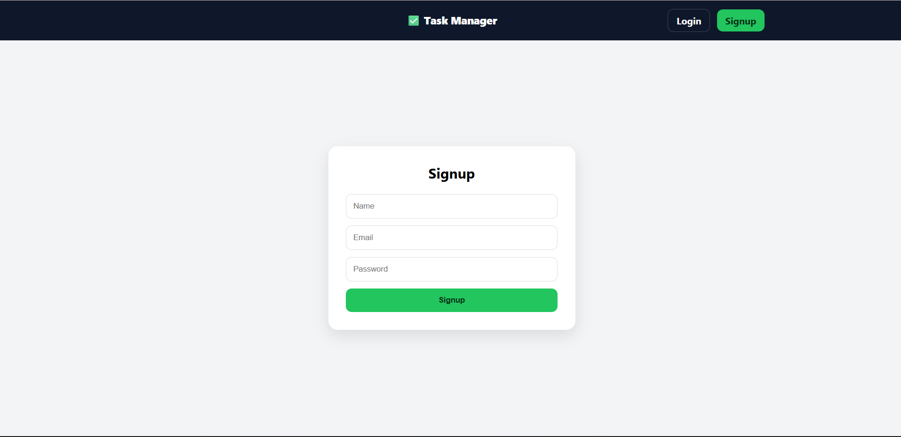
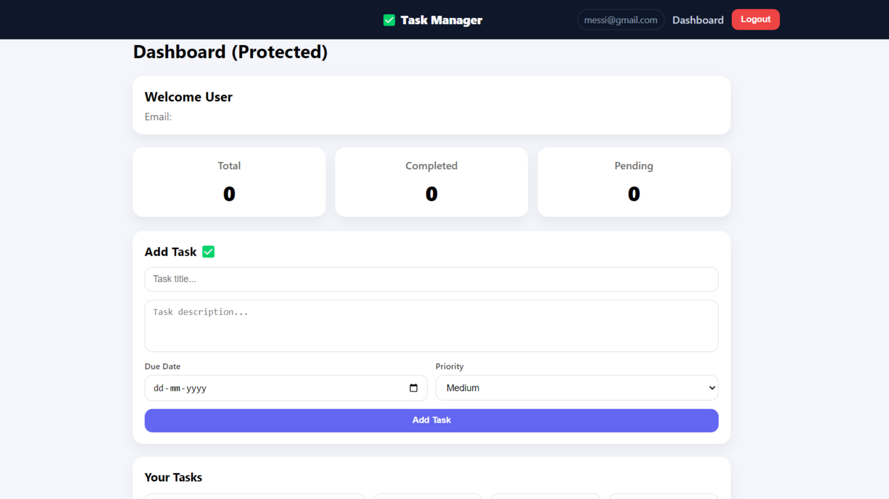

<!--  BANNER -->

  

<!--  TYPING INTRO -->
<h1 align="center">
    
</h1>

---

## 👤 About Me
- MERN Stack Developer passionate about building modern web apps  
- Currently learning **Advanced Backend & System Design**  
- Focused on **real-world problem solving**  
- Love turning ideas into products  

---

## 🌐 Portfolio & Resume

  
  

---

## 🛠️ Tech Stack

  

---

## 🐍 Contribution Snake

  

---

## 📊 GitHub Stats

  
  

---

## 🧠 Top Languages

  

---

## 🌌 Featured Projects
### 💬 Chat App (Real-Time)

  

🔗 **Live Demo:** https://chat-app-manoj.vercel.app/  
📂 **GitHub Repo:** https://github.com/manojkumar-mern/chat-app  

✨ **Features:**
- Real-time messaging using Socket.IO  
- Clean chat UI (WhatsApp-like)  
- Message timestamps & delivery status  
- Responsive design  

🛠️ **Tech Stack:** React, Node.js, Express, MongoDB, Socket.IO  

---

### 📝 Postly App (Social Media)

  

🔗 **Live Demo:** https://postly-react.vercel.app/  
📂 **GitHub Repo:** https://github.com/manojkumar-mern/postly  

✨ **Features:**
- Create & view posts  
- Like & comment system  
- Clean modern UI  
- Responsive layout  

🛠️ **Tech Stack:** React, Node.js, MongoDB  

---

### 📋 Task Manager (Full Stack)

  
  
  

🔗 **Live Demo:** https://task-manager-auth-mern.vercel.app/  
📂 **GitHub Repo:** https://github.com/manojkumar-mern/task-manager-auth 

✨ **Features:**
- Authentication (Login / Signup)  
- Protected dashboard  
- Task CRUD operations  
- Priority & due date system  

🛠️ **Tech Stack:** MERN Stack  

---

## 🌐 Connect With Me

  

---

## 🧑‍💻 Developer Mindset
> “First, solve the problem. Then, write the code.” 
